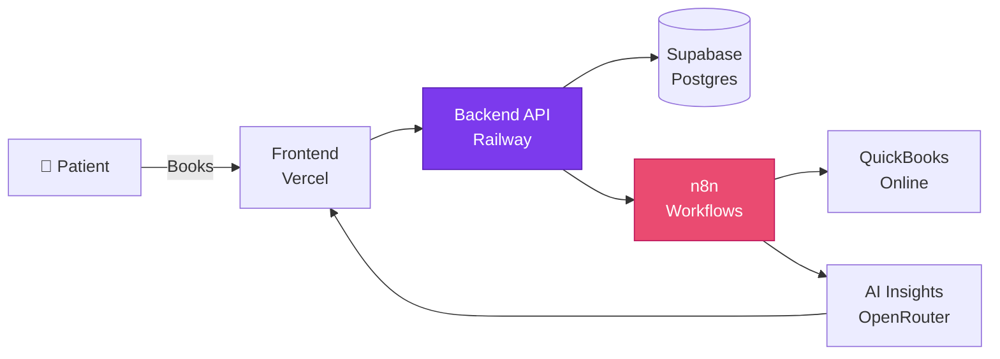
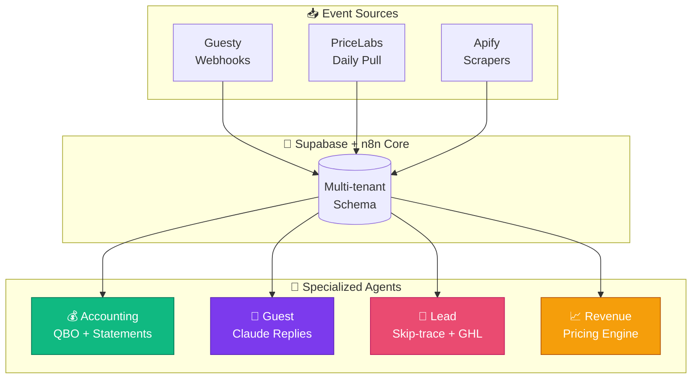
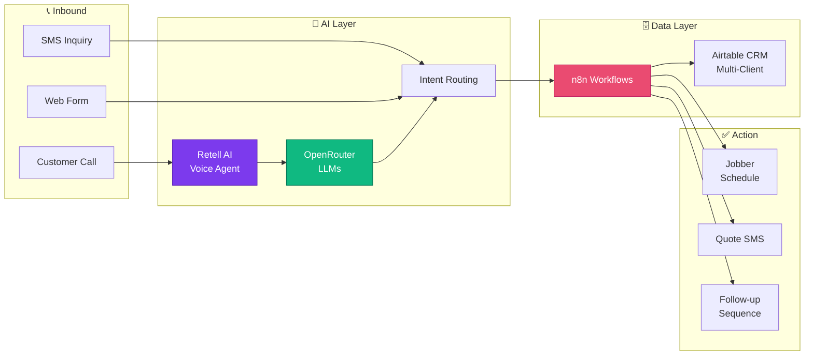
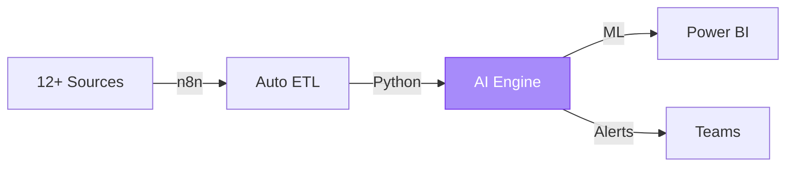

<div align="center">

<!-- ═══════════════════════════════════════════════════════════════════ -->
<!--                          ANIMATED HEADER                              -->
<!-- ═══════════════════════════════════════════════════════════════════ -->


<!-- TYPING ANIMATION -->
<a href="https://git.io/typing-svg">
  
</a>

<br/>

**Computer Science Engineering @ AIUB** &nbsp;•&nbsp; **Dhaka, Bangladesh** 🇧🇩

<br/>

<!-- SOCIAL BADGES -->
<a href="mailto:inafiul34@gmail.com">
  
</a>
<a href="https://linkedin.com/in/nafiul-islam">
  
</a>
<a href="https://x.com/ui_crafter">
  
</a>
<a href="https://github.com/nafiulislam">
  
</a>

<br/><br/>


</div>

<br/>

<!-- WAVE DIVIDER -->
<p align="center">
  
</p>

<br/>

<!-- ═══════════════════════════════════════════════════════════════════ -->
<!--                          WHO AM I                                     -->
<!-- ═══════════════════════════════════════════════════════════════════ -->

## 👋 Hey there, I'm Nafiul

<table>
<tr>
<td width="62%" valign="top">

### The Story

I see the world through **data**. While most people see spreadsheets and rows of numbers, I see **stories, patterns, and untapped opportunities**.

I'm a CSE student at AIUB who discovered something most analysts miss — the real magic isn't in *collecting* data. It's in **transforming it into decisions that drive millions in revenue**.

### My Superpower

I exist at a rare intersection of three disciplines:

```js
const nafiul = {
  analytics:    "📊 Decoding patterns in chaos",
  automation:   "⚡ Engineering systems that run themselves",
  design:       "🎨 Crafting interfaces people actually love",
  result:       "💰 Measurable business impact",
};
```

This combination means I don't just analyze data — I build **intelligent, automated systems** that:

- 🧠 **Think** — AI-powered insight generation
- ⚡ **Work 24/7** — Hands-off automation pipelines
- 🎨 **Look beautiful** — Executive-ready dashboards
- 💼 **Drive results** — Tied to real revenue

### What I Specialize In

> **AI-Automated Data Analysis for Business & Financial Operations**

End-to-end solutions that transform how companies handle data — from collection to insight to action.

</td>
<td width="38%" valign="top">


<br/><br/>

### 📈 Impact Snapshot

<div align="center">

| | |
|:-:|:-:|
| ⏱️ **Time Saved** | `90%+` |
| 💰 **Avg ROI** | `10x+` |
| 🎯 **Accuracy** | `100%` |
| ⚡ **Speed** | `Real-time` |

</div>

### 🌍 Languages

<div align="center">

| | |
|:-:|:-:|
| 🇬🇧 **English** | Fluent |
| 🇧🇩 **Bengali** | Native |
| 🇵🇰 **Urdu** | Proficient |

</div>

</td>
</tr>
</table>

<br/>

---

<!-- ═══════════════════════════════════════════════════════════════════ -->
<!--                          TECH ARSENAL                                 -->
<!-- ═══════════════════════════════════════════════════════════════════ -->

## 🛠️ Tech Arsenal

<div align="center">

<br/>

#### 🐍 Data Science & Analytics


<br/>

#### 📊 Business Intelligence & Visualization


<br/>

#### ⚡ Automation & Integration


<br/>

#### 🤖 AI & Machine Learning


<br/>

#### 🎨 Design & Frontend


<br/>

#### 🗄️ Databases & Backend


</div>

<br/>

---

<!-- ═══════════════════════════════════════════════════════════════════ -->
<!--                          FEATURED PROJECTS                            -->
<!-- ═══════════════════════════════════════════════════════════════════ -->

## 🚀 Featured Work

<div align="center">
  
</div>

<br/>

### 🏥 Project 01 — Enhance Aesthetics & Wellness Platform

> *Full-stack MedSpa management system with QuickBooks sync, AI-powered automations, and a custom CRM dashboard.*

<table>
<tr>
<td width="55%" valign="top">

#### 🎯 The Challenge

A growing MedSpa was juggling **fragmented tooling** — patient records in one system, accounting in another, marketing in a third. The team was stitching everything together by hand, and reconciling QuickBooks took **days each month**.

#### ✨ What I Built

A production system live on the open web:

- 🖥️ **Custom Admin Dashboard** — Next.js + Vercel
- 🔌 **Backend API Service** — Hosted on Railway
- 🗄️ **Supabase** — Real-time DB + auth
- 🔄 **n8n Automations** — Self-hosted workflow orchestration
- 💼 **QuickBooks OAuth Integration** — Auto invoice & transaction sync
- 🤖 **AI-Powered Insights** — Patient analytics & retention signals



</td>
<td width="45%" valign="top">

#### 🌐 Live Stack

| Layer | URL |
|:-----:|:----|
| 🎨 **Frontend** | [`dashboard-enhance-med.vercel.app`](https://dashboard-enhance-med.vercel.app) |
| ⚙️ **Backend** | Railway production |
| 🗄️ **DB** | Supabase |
| 🔄 **Automation** | Self-hosted n8n |

#### 📈 Outcomes

<div align="center">

| Before | After |
|:------:|:-----:|
| 3 disconnected tools | 1 unified platform |
| Multi-day QBO reconciliation | **Real-time sync** |
| Manual patient follow-up | **AI-driven workflows** |
| Spreadsheet chaos | **Live dashboards** |

</div>

<br/>


</td>
</tr>
</table>

**🔧 Tech Stack:** &nbsp;`Next.js` &nbsp;•&nbsp; `Vercel` &nbsp;•&nbsp; `Railway` &nbsp;•&nbsp; `Supabase` &nbsp;•&nbsp; `Postgres` &nbsp;•&nbsp; `n8n` &nbsp;•&nbsp; `QuickBooks API` &nbsp;•&nbsp; `OpenRouter` &nbsp;•&nbsp; `Python` &nbsp;•&nbsp; `TypeScript`

---

### 🏖️ Project 02 — Stay With Somos: Multi-Agent STR Platform

> *A 4-agent autonomous automation stack replacing $1,500/mo + $12k bookkeeping spend for a 30-property short-term rental portfolio.*

<table>
<tr>
<td width="55%" valign="top">

#### 🎯 The Challenge

A short-term rental operator (30 properties across CA & FL) was bleeding money on:

- 💸 **$12K spent on Hostvisors** — still no owner statements
- 🤖 **$1,500/mo on Conduit AI** — underperforming guest replies
- 📊 **Manual PriceLabs review** — leaving revenue on the table
- 🎯 **Ad-hoc owner acquisition** — no real lead pipeline

#### ✨ What I'm Building

A **multi-tenant, multi-agent automation stack** where each agent owns one domain end-to-end:



</td>
<td width="45%" valign="top">

#### 🤖 The 4 Agents

| Agent | Replaces | Output |
|:-----:|:---------|:-------|
| 💰 **Accounting** | Hostvisors | Owner statement PDFs + QBO sync |
| 💬 **Guest** | Conduit AI | Claude-powered Guesty replies |
| 🎯 **Lead** | Manual outreach | Apify → skip-trace → GoHighLevel |
| 📈 **Revenue** | Manual PriceLabs | Daily Claude-driven price tuning |

#### 🌟 Architectural Wins

✅ **Multi-Tenant by Design** — Same engine, infinite operators
✅ **Independently Deployable** — Each agent ships on its own
✅ **Cost Slashing** — Replaces $1,500+/mo SaaS spend
✅ **Owner-Statement Automation** — Months of manual work eliminated

<br/>


</td>
</tr>
</table>

#### 📊 Projected Impact

<div align="center">

| Metric | Before | After | Δ |
|:-------|:------:|:-----:|:-:|
| **Monthly SaaS Spend** | $1,500+ | **In-house** | `−100%` ⬇️ |
| **Owner Statement Lag** | Weeks | **Same-day** | `Real-time` ⚡ |
| **Properties Supported** | 30 | **Unlimited** | `∞ scale` 🚀 |
| **Bookkeeping Backlog** | Months | **Zero** | `Cleared` ✅ |

</div>

**🔧 Tech Stack:** &nbsp;`Supabase` &nbsp;•&nbsp; `n8n` &nbsp;•&nbsp; `Claude API` &nbsp;•&nbsp; `Python` &nbsp;•&nbsp; `QuickBooks API` &nbsp;•&nbsp; `Guesty API` &nbsp;•&nbsp; `GoHighLevel` &nbsp;•&nbsp; `PriceLabs` &nbsp;•&nbsp; `Apify` &nbsp;•&nbsp; `Postgres RLS`

---

### 🚚 Project 03 — Movers Assistance Automation Suite

> *End-to-end voice & SMS automation for a moving-services CRM — from cold inbound call to job scheduled in Jobber.*

<div align="center">



</div>

<br/>

<table>
<tr>
<td width="33%" align="center" valign="top">

#### 🎙️ Voice AI
**Retell AI Agent**


24/7 inbound call handling with natural conversation & quote generation

</td>
<td width="33%" align="center" valign="top">

#### 🔄 Workflow Engine
**n8n Multi-Client**


`client_id` on every record — one engine, infinite tenants

</td>
<td width="33%" align="center" valign="top">

#### 📅 Job Scheduler
**Jobber Integration**


Auto-schedules confirmed moves with full customer context attached

</td>
</tr>
</table>

#### 📊 Business Outcomes

<div align="center">

| Metric | Before | After | Impact |
|:-------|:------:|:-----:|:------:|
| **Lead Response Time** | Hours | **Seconds** | ⚡ Instant |
| **After-hours Calls Captured** | 0% | **100%** | 🌙 24/7 coverage |
| **Manual Data Entry** | High | **Near-zero** | 🤖 Fully automated |
| **Multi-client Scale** | 1 | **Unlimited** | 🏢 SaaS-ready |

</div>

**🔧 Tech Stack:** &nbsp;`n8n` &nbsp;•&nbsp; `Retell AI` &nbsp;•&nbsp; `Airtable` &nbsp;•&nbsp; `Jobber API` &nbsp;•&nbsp; `OpenRouter` &nbsp;•&nbsp; `Python` &nbsp;•&nbsp; `Webhooks`

---

### 📊 Project 04 — Intelligent Financial Analytics Platform

> *Replaced 40 hours/week of manual finance reporting with a self-running AI pipeline.*

<table>
<tr>
<td width="50%" valign="top">

#### 💼 The Business Problem

Finance teams were drowning:

- ⏳ **40+ hours/week** on manual data wrangling
- 📊 Reports outdated **before they were finished**
- ❌ Costly human errors in calculations
- 🐢 Decisions made on **week-old data**

#### ✨ The Solution



#### 🎯 Key Features

✅ **Auto Data Collection** — 12+ sources, every 6 hrs
✅ **AI Anomaly Detection** — Catches what humans miss
✅ **Predictive Forecasting** — 30-90 day trend models
✅ **Natural-Language Insights** — AI-written summaries
✅ **Mobile Dashboards** — Decisions on the go

</td>
<td width="50%" valign="top">

#### 📈 Business Impact

<div align="center">

| Before | After | Δ |
|:------:|:-----:|:-:|
| 40 hrs/wk | 4 hrs/wk | **−90%** ⬇️ |
| Manual errors | Zero errors | **−100%** ✅ |
| Weekly reports | Real-time | **∞ faster** ⚡ |
| $0 saved | $120K/yr | **+ROI** 💰 |

</div>

<br/>


</td>
</tr>
</table>

**🔧 Tech Stack:** &nbsp;`Python` &nbsp;•&nbsp; `Pandas` &nbsp;•&nbsp; `scikit-learn` &nbsp;•&nbsp; `n8n` &nbsp;•&nbsp; `Power BI` &nbsp;•&nbsp; `SQL` &nbsp;•&nbsp; `REST APIs`

---

### 🎯 Project 05 — Customer Intelligence & Prediction Engine

> *RFM segmentation + churn prediction + LTV forecasting — production ML at startup speed.*

<table>
<tr>
<td width="33%" align="center" valign="top">

### 🎯 Segmentation
**RFM + K-Means**


**`87%`** Accuracy

5 customer segments identified for targeted marketing campaigns

</td>
<td width="33%" align="center" valign="top">

### 🚨 Churn Prediction
**Random Forest**


**`91%`** Precision

Predict customer churn **60 days** in advance — proactive retention

</td>
<td width="33%" align="center" valign="top">

### 💰 Lifetime Value
**Regression Models**


**`R² = 0.84`**

Forecast customer value over a 3-year horizon

</td>
</tr>
</table>

#### 📊 Business Results

<div align="center">

| Metric | Before | After | Impact |
|:-------|:------:|:-----:|:------:|
| **Customer Retention** | 68% | **83%** | `+23%` ⬆️ |
| **Campaign ROI** | 2.1x | **4.7x** | `+124%` ⬆️ |
| **Revenue** | $850K | **$1.05M** | `+$200K` ⬆️ |
| **Analysis Time** | 5 days | **2 hrs** | `−98%` ⬇️ |

</div>

**🔧 Tech Stack:** &nbsp;`Python` &nbsp;•&nbsp; `scikit-learn` &nbsp;•&nbsp; `Pandas` &nbsp;•&nbsp; `n8n` &nbsp;•&nbsp; `Power BI` &nbsp;•&nbsp; `FastAPI` &nbsp;•&nbsp; `PostgreSQL`

---

### ⚙️ Project 06 — Automated BI Reporting Suite

> *One platform to replace every "can you send me that report?" email.*

<table>
<tr>
<td width="60%" valign="top">

#### 🎯 The Vision

Instead of every department building reports in isolation, I designed a **unified, intelligent reporting platform**:

- 🤖 **Fully Automated** — Zero manual intervention
- 🎨 **Template-Based** — New reports in minutes
- 🧠 **AI-Enhanced** — Auto-summaries & narratives
- 📱 **Multi-Channel** — Email, Slack, dashboards, mobile
- ⏰ **Smart Scheduling** — Time, event, or condition triggered

#### 🌟 What Makes It Different

<div align="center">

| Feature | Impact |
|:--------|:------:|
| 📊 Dynamic Visualizations | Always current |
| 🤖 AI Summaries | Non-tech friendly |
| ⚡ Exception Alerts | 80% less noise |
| 🎨 Custom Branding | Executive-ready |

</div>

</td>
<td width="40%" valign="top">


<br/><br/>

#### 📊 Usage Stats

```yaml
Reports:        1,200+/month
Active Users:   150+ across 8 depts
Time Saved:     300+ hrs/month
Cost Savings:   $85K/year
```

</td>
</tr>
</table>

**🔧 Tech Stack:** &nbsp;`Python` &nbsp;•&nbsp; `n8n` &nbsp;•&nbsp; `Power BI` &nbsp;•&nbsp; `Excel` &nbsp;•&nbsp; `OpenAI API` &nbsp;•&nbsp; `Slack API` &nbsp;•&nbsp; `Pandas`

<br/>

---

<!-- ═══════════════════════════════════════════════════════════════════ -->
<!--                          GITHUB ANALYTICS                             -->
<!-- ═══════════════════════════════════════════════════════════════════ -->

## 📊 GitHub Analytics

<div align="center">


<br/>


<br/>


</div>

<br/>

---

<!-- ═══════════════════════════════════════════════════════════════════ -->
<!--                          CURRENTLY LEARNING                           -->
<!-- ═══════════════════════════════════════════════════════════════════ -->

## 🌱 Currently Mastering

<div align="center">
  
  
  
  
  
  
</div>

<br/>

<table>
<tr>
<td width="50%" valign="top">

### 🧠 Advanced Analytics & AI

- 🔮 **Deep Learning for Time Series** — LSTM & Transformers for financial forecasting
- 📝 **Natural Language Processing** — Insight extraction from unstructured business docs
- 🤖 **AutoML & Hyperparameter Tuning** — Automated model optimization
- 🚀 **MLOps & Model Deployment** — Production-grade ML systems
- 🔬 **Causal Inference** — Understanding what *actually* drives outcomes

</td>
<td width="50%" valign="top">

### ⚡ Next-Level Automation

- 🔧 **Advanced n8n Workflows** — Complex multi-step pipelines with error handling
- 🔌 **API Development** — FastAPI & Flask data services
- ☁️ **Cloud Automation** — AWS Lambda, Azure Functions for serverless analytics
- 📡 **Real-Time Streaming** — Apache Kafka for live data
- 🏗️ **Infrastructure as Code** — Terraform for reproducible data infra

</td>
</tr>
<tr>
<td width="50%" valign="top">

### 📊 Business Intelligence Mastery

- 🧮 **Advanced DAX** — Complex Power BI calculations & time intelligence
- 🎨 **Custom D3.js Visualizations** — Interactive web-based viz
- 🔗 **Embedded Analytics** — Integrating BI into web apps
- 📖 **Data Storytelling** — Narrative-driven dashboard design
- ⚡ **Performance Optimization** — Handling billions of rows efficiently

</td>
<td width="50%" valign="top">

### 🎨 Design & User Experience

- 🧠 **Dashboard Psychology** — Visualizations that drive action
- ♿ **Accessibility Standards** — WCAG-compliant data viz
- 📱 **Mobile-First BI** — Analytics optimized for any device
- 🎯 **Design Systems** — Scalable, consistent component libraries
- 🔍 **User Research & Testing** — Building what users actually need

</td>
</tr>
</table>

<br/>

---

<!-- ═══════════════════════════════════════════════════════════════════ -->
<!--                          PHILOSOPHY                                   -->
<!-- ═══════════════════════════════════════════════════════════════════ -->

## 💡 My Philosophy

<div align="center">
  
</div>

<br/>

<table>
<tr>
<td align="center" width="20%">

### 🤖
**Automate Everything**

If you do it twice, write code to do it forever

</td>
<td align="center" width="20%">

### 🎨
**Design Matters**

Ugly dashboards don't get used, no matter how accurate

</td>
<td align="center" width="20%">

### 💡
**Impact > Complexity**

The best solution is the simplest one that works

</td>
<td align="center" width="20%">

### 📖
**Data Tells Stories**

Numbers alone don't drive decisions — narratives do

</td>
<td align="center" width="20%">

### 🚀
**Never Stop Learning**

Today's cutting edge is tomorrow's baseline

</td>
</tr>
</table>

<br/>

---

<!-- ═══════════════════════════════════════════════════════════════════ -->
<!--                          CONTACT                                      -->
<!-- ═══════════════════════════════════════════════════════════════════ -->

## 📫 Let's Build Something Amazing

<div align="center">


<br/><br/>

### 💬 I'm Open To:

🤝 &nbsp;**Collaborating** on data analytics & automation projects
💼 &nbsp;**Freelance work** in BI, AI, and data engineering
🎓 &nbsp;**Mentoring** aspiring data analysts and automation engineers
🚀 &nbsp;**Discussing** the future of AI-powered business intelligence
☕ &nbsp;**Connecting** with fellow data enthusiasts and builders

<br/>

### 📨 Get In Touch

<a href="mailto:inafiul34@gmail.com">
  
</a>
<a href="https://linkedin.com/in/nafiul-islam">
  
</a>
<a href="https://x.com/ui_crafter">
  
</a>
<a href="https://github.com/nafiulislam">
  
</a>

<br/><br/>

### 💭 Words of Wisdom


<br/>


</div>

<br/>

---

<div align="center">


### ⭐ If my work resonates with you, star my repositories!

**Crafted with ❤️, ☕, and a *lot* of data — by Nafiul Islam**

<sub>Last Updated: May 2026 &nbsp;•&nbsp; Built for Impact</sub>

</div>
