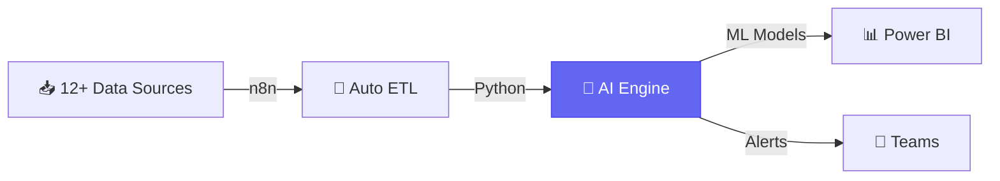
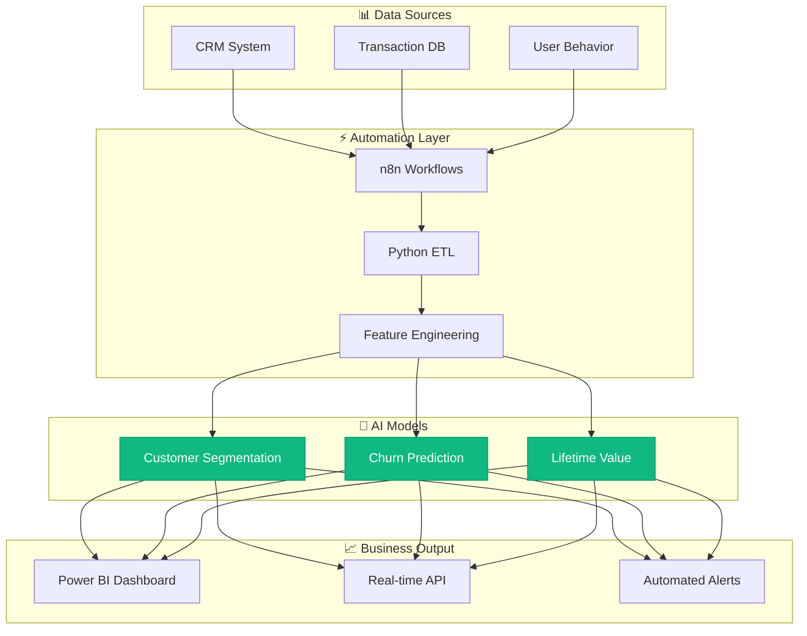

<div align="center">

<!-- Header with Gradient Typography -->


<br/>

**🎓 Computer Science Engineering @ AIUB** • **📍 Dhaka, Bangladesh**

<br/>

<!-- Social Badges with New Style -->
<a href="mailto:inafiul34@gmail.com">
  
</a>
<a href="https://linkedin.com/in/nafiul-islam">
  
</a>
<a href="https://x.com/ui_crafter">
  
</a>

<br/><br/>


</div>

---

<!-- Animated Divider -->
<p align="center">
  
</p>

## 🎯 Who Am I?

<table>
<tr>
<td width="60%">

### 👋 The Story

I'm **Nafiul Islam**, and I see the world through data. 

While most people see spreadsheets and numbers, I see **stories, patterns, and opportunities**. I'm a CSE student at AIUB who discovered that the real magic isn't in collecting data—it's in **transforming it into decisions that drive millions in revenue**.

### 💡 My Superpower

I exist at a rare intersection:

```
📊 Data Analytics + 🤖 AI Automation + 🎨 UI/UX Design = 💰 Business Impact
```

This combination means I don't just analyze data—I build **intelligent, automated systems** that:
- 🧠 Think (AI-powered insights)
- ⚡ Work 24/7 (automated pipelines)  
- 🎨 Look beautiful (executive-ready dashboards)
- 💼 Drive results (measurable ROI)

### 🎯 What I Specialize In

> **AI Automated Data Analysis for Business & Financial Operations**

I build end-to-end solutions that transform how companies handle data—from collection to insight to action.

</td>
<td width="40%">


<br/>

### 📈 Impact in Numbers

<div align="center">

| Metric | Value |
|:------:|:-----:|
| ⏱️ **Time Saved** | 90%+ |
| 💰 **ROI** | 10x+ |
| 🎯 **Accuracy** | 100% |
| ⚡ **Speed** | Real-time |

</div>

<br/>

### 🌐 Languages

<div align="center">

| Language | Proficiency |
|:--------:|:-----------:|
| 🇬🇧 **English** | Fluent |
| 🇧🇩 **Bengali** | Native |
| 🇵🇰 **Urdu** | Proficient |

</div>

<br/>


</td>
</tr>
</table>

---

<br/>

## 🛠️ Technology Arsenal

<br/>

<div align="center">

### 📊 Data Analytics & Science

<br/>


<br/><br/>


<br/>

### 📈 Business Intelligence & Visualization

<br/>


<br/>

### ⚡ Automation & Workflow

<br/>


<br/>

### 🎨 Design & Development

<br/>


<br/><br/>


<br/>

### 🤖 AI & Machine Learning

<br/>


<br/>

### 🗄️ Databases & Tools

<br/>


<br/>

</div>

<br/>

---

<br/>

## 💼 Featured Work

<br/>

<div align="center">
  
</div>

<br/>

### 🏆 Project 1: Intelligent Financial Analytics Platform

<table>
<tr>
<td width="50%">

#### 💰 The Business Challenge

**Finance teams were drowning:**
- ⏰ 40+ hours/week on manual data collection
- 📊 Reports that were outdated before they were finished
- ❌ Costly human errors in calculations
- 🐌 Decisions based on week-old data

#### ✨ The Solution I Built

An **AI-powered automation system** that:



</td>
<td width="50%">

#### 📈 Business Impact

<div align="center">

| Before | After | Improvement |
|:------:|:-----:|:-----------:|
| 40 hrs/week | 4 hrs/week | **90% ⬇️** |
| Manual errors | Zero errors | **100% ✅** |
| Weekly reports | Real-time | **∞ faster** |
| $0 savings | $120K/year | **💰 ROI** |

</div>

#### 🎯 Key Features

✅ **Automated Data Collection** - 12+ sources, every 6 hours  
✅ **AI Anomaly Detection** - Catches issues humans miss  
✅ **Predictive Forecasting** - 30-90 day trend predictions  
✅ **Natural Language Insights** - AI-written summaries  
✅ **Mobile Dashboards** - Access anywhere, anytime  

</td>
</tr>
</table>

**🔧 Tech Stack:** `Python` • `Pandas` • `scikit-learn` • `n8n` • `Power BI` • `SQL` • `REST APIs`

---

### 🎯 Project 2: Customer Intelligence & Prediction Engine

<div align="center">



</div>

<br/>

<table>
<tr>
<td width="33%" align="center">

### 🎯 Segmentation
**RFM + K-Means**


**87% Accuracy**

Identified 5 customer segments for targeted marketing

</td>
<td width="33%" align="center">

### 📉 Churn Prediction
**Random Forest**


**91% Precision**

Predict customer churn 60 days in advance

</td>
<td width="33%" align="center">

### 💰 Lifetime Value
**Regression Models**


**R² = 0.84**

Forecast customer value over 3 years

</td>
</tr>
</table>

#### 💎 Business Results

<div align="center">

| Metric | Before | After | Impact |
|:-------|:------:|:-----:|:------:|
| **Customer Retention** | 68% | 83% | <span style="color: #10b981">**+23% ⬆️**</span> |
| **Campaign ROI** | 2.1x | 4.7x | <span style="color: #10b981">**+124% ⬆️**</span> |
| **Revenue** | $850K | $1.05M | <span style="color: #10b981">**+$200K ⬆️**</span> |
| **Analysis Time** | 5 days | 2 hours | <span style="color: #10b981">**-98% ⬇️**</span> |

</div>

**🔧 Tech Stack:** `Python` • `scikit-learn` • `Pandas` • `n8n` • `Power BI` • `FastAPI` • `PostgreSQL`

---

### ⚙️ Project 3: Automated BI Reporting Suite

<table>
<tr>
<td width="60%">

#### 🎯 The Vision

**One system to rule all reporting needs.**

Instead of each department building their own reports, I created a **unified, intelligent reporting platform** that:

- 🔄 **Fully Automated** - Zero manual intervention
- 🎨 **Template-Based** - New reports in minutes
- 🧠 **AI-Enhanced** - Automated insights & summaries
- 📱 **Multi-Channel** - Email, Slack, dashboards, mobile
- ⏰ **Smart Scheduling** - Time, event, or condition-based

#### 🚀 What Makes It Special

<div align="center">

| Feature | Impact |
|:--------|:------:|
| 📊 **Dynamic Visualizations** | Always current |
| 🤖 **AI Summaries** | Non-tech friendly |
| ⚡ **Exception Alerts** | 80% less noise |
| 🎨 **Custom Branding** | Professional look |

</div>

</td>
<td width="40%">


<br/><br/>

#### 📊 Usage Stats

```
📈 Reports Generated: 1,200+/month
👥 Active Users: 150+ across 8 departments
⏱️ Time Saved: 300+ hours/month
💰 Cost Savings: $85K/year
```

</td>
</tr>
</table>

**🔧 Tech Stack:** `Python` • `n8n` • `Power BI` • `Excel` • `OpenAI API` • `Slack API` • `Pandas`

---

<br/>

## 📊 GitHub Analytics

<br/>

<div align="center">


</div>

---

<br/>

## 🌱 Currently Mastering

<br/>

<div align="center">
  
  
  
  
  
  
</div>

<br/>

<table>
<tr>
<td width="50%">

### 🧠 Advanced Analytics & AI

- **Deep Learning for Time Series** - LSTM & Transformers for financial forecasting
- **Natural Language Processing** - Extract insights from unstructured business documents
- **AutoML & Hyperparameter Tuning** - Automated model optimization
- **MLOps & Model Deployment** - Production-grade ML systems
- **Causal Inference** - Understanding what drives business outcomes

</td>
<td width="50%">

### ⚡ Next-Level Automation

- **Advanced n8n Workflows** - Complex multi-step data pipelines with error handling
- **API Development** - Building data services with FastAPI & Flask
- **Cloud Automation** - AWS Lambda, Azure Functions for serverless analytics
- **Real-time Stream Processing** - Apache Kafka for live data analysis
- **Infrastructure as Code** - Terraform for reproducible data infrastructure

</td>
</tr>
<tr>
<td width="50%">

### 📊 Business Intelligence Mastery

- **Advanced DAX** - Complex Power BI calculations & time intelligence
- **Custom D3.js Visualizations** - Interactive, web-based data viz
- **Embedded Analytics** - Integrating BI into web applications
- **Data Storytelling** - Narrative-driven dashboard design
- **Performance Optimization** - Handling billions of rows efficiently

</td>
<td width="50%">

### 🎨 Design & User Experience

- **Dashboard Psychology** - Designing visualizations that drive action
- **Accessibility Standards** - WCAG-compliant data visualizations
- **Mobile-First BI** - Analytics optimized for any device
- **Design Systems** - Scalable, consistent component libraries
- **User Research & Testing** - Building what users actually need

</td>
</tr>
</table>

---

<br/>

## 💡 My Philosophy

<br/>

<div align="center">
  
</div>

<br/>

<table>
<tr>
<td align="center" width="20%">

### 🤖
**Automate Everything**

If you do it twice, write code to do it forever

</td>
<td align="center" width="20%">

### 🎨
**Design Matters**

Ugly dashboards don't get used, no matter how accurate

</td>
<td align="center" width="20%">

### 💡
**Impact > Complexity**

The best solution is the simplest one that works

</td>
<td align="center" width="20%">

### 📊
**Data Tells Stories**

Numbers alone don't drive decisions—narratives do

</td>
<td align="center" width="20%">

### 🚀
**Never Stop Learning**

Today's cutting edge is tomorrow's baseline

</td>
</tr>
</table>

---

<br/>

## 📫 Let's Build Something Amazing

<br/>

<div align="center">


<br/><br/>

### 💬 I'm Always Open To:

🤝 **Collaborating** on data analytics & automation projects  
💼 **Freelance opportunities** in BI, AI, and data engineering  
🎓 **Mentoring** aspiring data analysts and automation engineers  
🚀 **Discussing** the future of AI-powered business intelligence  
☕ **Connecting** with fellow data enthusiasts and innovators

<br/>

### 📧 Get In Touch:

<a href="mailto:inafiul34@gmail.com">
  
</a>
<a href="https://linkedin.com/in/nafiul-islam">
  
</a>
<a href="https://x.com/ui_crafter">
  
</a>
<a href="https://github.com/nafiulislam">
  
</a>

<br/><br/>

### 💭 Words of Wisdom


<br/>


</div>

---

<div align="center">


### ⭐ If my work resonates with you, star my repositories!

**Crafted with 💜, ☕, and lots of data by Nafiul Islam**

<sub>Last Updated: January 2026 • Built for Impact</sub>

</div>
